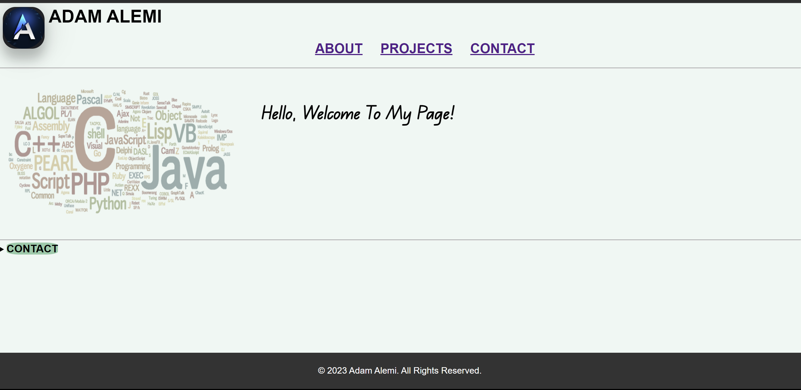
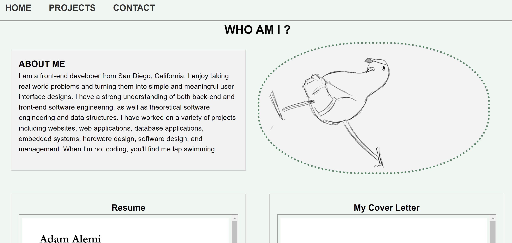
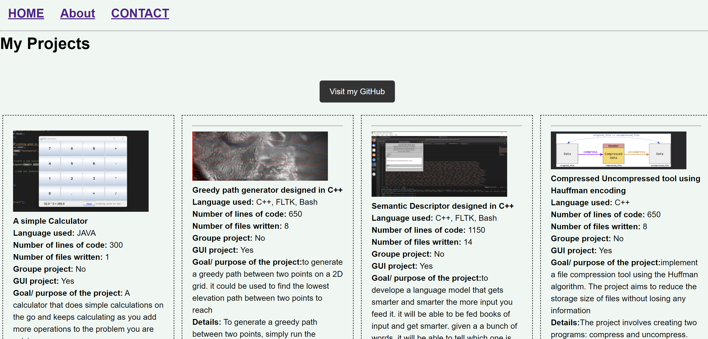
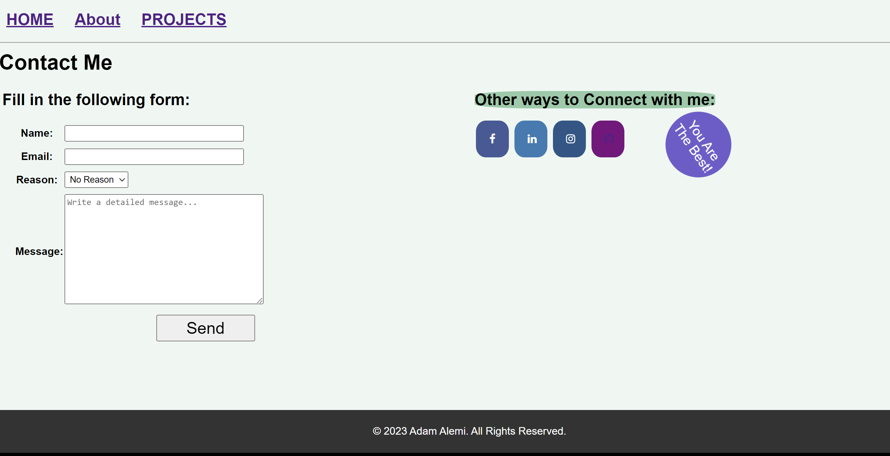

# Portfolio Website

This is my portfolio website, showcasing my projects, skills, and experiences. You can visit the live website at <https://chipper-kitsune-d5866b.netlify.app>

## Table of Contents

- [Portfolio Website](#portfolio-website)
  - [Table of Contents](#table-of-contents)
  - [Description](#description)
  - [Technologies Used](#technologies-used)
  - [Features](#features)
  - [Installation](#installation)
  - [Usage](#usage)
  - [Contributing](#contributing)
  - [Contact](#contact)
  - [GUI](#gui)

## Description

The website is built using HTML, CSS, and JavaScript, and it's hosted on Netlify. It includes a homepage, a projects page, an about page, and a contact page.

## Technologies Used

- HTML
- CSS
- JavaScript
- Netlify

## Features

- Responsive design
- Smooth scrolling
- Animated sections
- Contact form

## Installation

To run this website locally, you can clone this repository by running the following command: git clone <https://github.com/naseralemi12/HW4.git>
Then, open the `index.html` file in your web browser.

## Usage

Feel free to use this website as a template for your own portfolio website. You can customize the content, styling, and functionality to suit your needs.

## Contributing

If you find any bugs or issues with the website, please feel free to open an issue or submit a pull request.

## Contact

If you have any questions or suggestions, please feel free to contact me at [naseralemi12@gmail.com](mailto:naseralemi12@gmail.com).

## GUI

